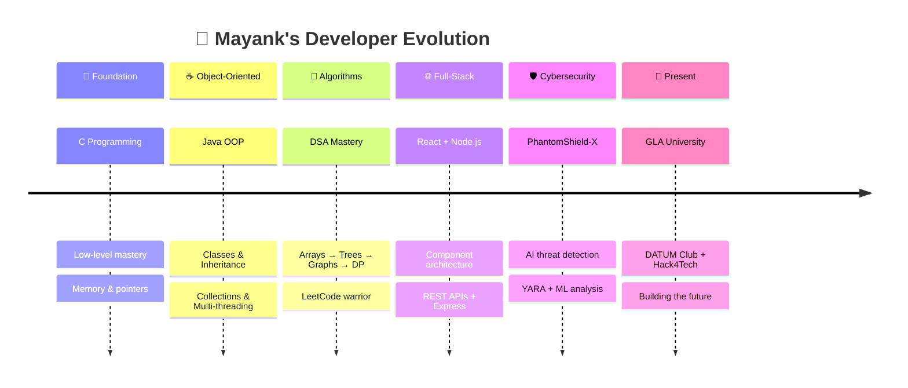

<!-- ╔══════════════════════════════════════════════════════════════════╗ -->
<!-- ║  🔮 MAYANK RAJ — ELITE TECH GITHUB PROFILE                    ║ -->
<!-- ║  Theme: Purple + Violet + Cyan on Dark                        ║ -->
<!-- ╚══════════════════════════════════════════════════════════════════╝ -->

<!-- ━━━━━━━━━━━━━━ 3D ANIMATED HERO BANNER ━━━━━━━━━━━━━━ -->
<p align="center">
  
</p>

<!-- ━━━━━━━━━━━━━━ ANIMATED CODING GIF ━━━━━━━━━━━━━━ -->
<p align="center">
  
</p>

<!-- ━━━━━━━━━━━━━━ GLITCH TYPING ANIMATION ━━━━━━━━━━━━━━ -->
<p align="center">
  <a href="https://github.com/mayank7720">
    
  </a>
</p>

<!-- ━━━━━━━━━━━━━━ ANIMATED NEON DIVIDER ━━━━━━━━━━━━━━ -->
<p align="center">
  
</p>

<!-- ━━━━━━━━━━━━━━ BADGE BAR ━━━━━━━━━━━━━━ -->
<p align="center">
  <a href="https://github.com/mayank7720?tab=followers">
    
  </a>
  &nbsp;
  
  &nbsp;
  
  &nbsp;
  <a href="https://github.com/mayank7720?tab=repositories">
    
  </a>
  &nbsp;
  
</p>

<br/>

<!-- ━━━━━━━━━━━━━━ 3D AVATAR + ABOUT ME ━━━━━━━━━━━━━━ -->


##  `> sudo cat /etc/identity`

```js
const mayank = {
    name: "Mayank Raj",
    title: "Future Software Engineer",
    location: "GLA University • B.Tech CSE",
    clubs: ["DATUM Club", "Hack4Tech"],
    arsenal: ["Java", "JavaScript", "Python", "C"],
    battleground: ["DSA", "Full-Stack Dev", "AI/ML"],
    motto: "Code. Break. Fix. Deploy. Repeat. 🔁",
    funFact: "I speak fluent Java ☕ and sarcasm 😏",
    status: "☕ Turning caffeine into code..."
};
```

<br clear="both"/>

<!-- ━━━━━━━━━━━━━━ ANIMATED DIVIDER ━━━━━━━━━━━━━━ -->


<!-- ━━━━━━━━━━━━━━ HACKER TERMINAL ━━━━━━━━━━━━━━ -->

<p align="center">
  
</p>

<br/>

```
                                 ╔═══════════════════════════════════════════╗
    ╔══════════════╗             ║  mayank@cybercore                         ║
    ║ ▓▓▓▓▓▓▓▓▓▓ ║             ╠═══════════════════════════════════════════╣
    ║ ▓ ██  ██ ▓ ║             ║  🖥️  OS      → B.Tech CSE @ GLA Univ     ║
    ║ ▓        ▓ ║             ║  🏠 Host    → Future Software Engineer    ║
    ║ ▓ ██████ ▓ ║             ║  ⚙️  Kernel  → Java | React | Node.js     ║
    ║ ▓        ▓ ║             ║  🐚 Shell   → VS Code + Neovim           ║
    ║ ▓▓▓▓▓▓▓▓▓▓ ║             ║  🧠 CPU     → DSA + Problem Solving      ║
    ╚══════════════╝             ║  🎮 GPU     → UI/UX + 3D Animations      ║
                                 ║  💾 RAM     → Infinite Curiosity 🧪      ║
    ░░░░░░░░░░░░░░░             ║  📡 Net     → Always Online 🌐           ║
                                 ║  🏆 Clubs   → DATUM | Hack4Tech          ║
                                 ║  ⏱️  Uptime  → Coding since day ∞        ║
                                 ╚═══════════════════════════════════════════╝
```

<br/>

```bash
mayank@cybercore:~$ cat /proc/skills.json
```

```json
{
  "🔥 mastered": ["Java", "DSA", "OOP", "Problem Solving"],
  "⚡ building": ["React.js", "Node.js", "Express.js", "REST APIs"],
  "🧠 databases": ["MySQL", "MongoDB", "Firebase"],
  "🌱 exploring": ["AI/ML", "System Design", "Docker", "Cloud"],
  "🎯 next_mission": ["Open Source", "Hackathon Wins", "SDE Role"]
}
```

<br/>

<!-- ━━━━━━━━━━━━━━ ANIMATED DIVIDER ━━━━━━━━━━━━━━ -->


<!-- ━━━━━━━━━━━━━━ TECH ARSENAL ━━━━━━━━━━━━━━ -->

<p align="center">
  
</p>

<p align="center">
  
</p>

<table align="center">
  <tr>
    <td align="center" width="140">
      <h4>⚔️ Languages</h4>
    </td>
    <td align="center">
      
    </td>
  </tr>
  <tr>
    <td align="center" width="140">
      <h4>🚀 Frameworks</h4>
    </td>
    <td align="center">
      
    </td>
  </tr>
  <tr>
    <td align="center" width="140">
      <h4>🗄️ Databases</h4>
    </td>
    <td align="center">
      
    </td>
  </tr>
  <tr>
    <td align="center" width="140">
      <h4>🛠️ DevTools</h4>
    </td>
    <td align="center">
      
    </td>
  </tr>
</table>

<br/>

<!-- ━━━━━━━━━━━━━━ ANIMATED DIVIDER ━━━━━━━━━━━━━━ -->


<!-- ━━━━━━━━━━━━━━ GITHUB ANALYTICS ━━━━━━━━━━━━━━ -->

<p align="center">
  
</p>

<p align="center">
  
</p>

<br/>

<p align="center">
  
  &nbsp;&nbsp;
  
</p>

<br/>

<!-- ━━━━━━━━━━━━━━ STREAK STATS ━━━━━━━━━━━━━━ -->
<p align="center">
  
</p>

<br/>

<!-- ━━━━━━━━━━━━━━ ACTIVITY GRAPH ━━━━━━━━━━━━━━ -->
<p align="center">
  
</p>

<br/>

<!-- ━━━━━━━━━━━━━━ ANIMATED DIVIDER ━━━━━━━━━━━━━━ -->


<!-- ━━━━━━━━━━━━━━ CONTRIBUTION SNAKE ━━━━━━━━━━━━━━ -->

<p align="center">
  
</p>

<p align="center">
  <picture>
    <source media="(prefers-color-scheme: dark)" srcset="https://raw.githubusercontent.com/mayank7720/mayank7720/output/github-contribution-grid-snake-dark.svg">
    <source media="(prefers-color-scheme: light)" srcset="https://raw.githubusercontent.com/mayank7720/mayank7720/output/github-contribution-grid-snake.svg">
    
  </picture>
</p>

<br/>

<!-- ━━━━━━━━━━━━━━ 3D CONTRIBUTION CHART ━━━━━━━━━━━━━━ -->

<p align="center">
  
</p>

<p align="center">
  
</p>

<br/>


<!-- ━━━━━━━━━━━━━━ ANIMATED DIVIDER ━━━━━━━━━━━━━━ -->


<!-- ━━━━━━━━━━━━━━ FEATURED PROJECTS ━━━━━━━━━━━━━━ -->

<p align="center">
  
</p>

<p align="center">
  
</p>

<br/>

<div align="center">

<a href="https://github.com/mayank7720/PhantomShield-X">
  
</a>
<a href="https://github.com/mayank7720/Online-Food-Delivery-App-Backend">
  
</a>
<a href="https://github.com/mayank7720/My-Portfolio">
  
</a>
<a href="https://github.com/mayank7720/DSA-">
  
</a>

</div>

<br/>

<!-- ━━━━━━━━ PROJECT DEEP-DIVES ━━━━━━━━ -->

<details>
<summary><h3>🛡️ PhantomShield-X — AI Cybersecurity Platform</h3></summary>
<br/>

> 🔬 **Enterprise-grade AI-driven cybersecurity defense** with real-time threat detection, behavioral ML analysis, and multi-device endpoint protection.

| Feature | Detail |
|---------|--------|
| 🧠 AI Engine | Isolation Forest ML anomaly detection |
| 🔍 Scanning | Multi-layer YARA + EMBER + VirusTotal |
| 🌐 Analysis | URL & phishing detection engine |
| 🖥️ Agent | Cross-platform device monitoring |
| 🧩 Extension | Chrome Manifest V3 |
| 📡 Dashboard | Centralized admin control |

```
Tech: FastAPI + React + TypeScript + scikit-learn + YARA
```

<p align="center">
  <a href="https://phantom-shield-x.vercel.app"></a>
  <a href="https://github.com/mayank7720/PhantomShield-X"></a>
</p>

</details>

<details>
<summary><h3>🍔 Food Delivery Backend — Enterprise Java</h3></summary>
<br/>

> ☕ **Full-featured food delivery backend** — Pure Java, OOP, exception handling, collections, multi-threading.

- 🏗️ Clean MVC + SOLID architecture
- 🔐 Custom exception handling framework
- 📦 Collections-based order management
- 🧵 Multi-threaded order processing

</details>

<br/>

<!-- ━━━━━━━━━━━━━━ ANIMATED DIVIDER ━━━━━━━━━━━━━━ -->


<!-- ━━━━━━━━━━━━━━ HACKATHON ACHIEVEMENTS ━━━━━━━━━━━━━━ -->

<p align="center">
  
</p>

<br/>

<div align="center">

| 🎯 Achievement | 📋 Details |
|:---:|:---|
| 🏅 **DATUM Club** | Active member — Tech events & workshops at GLA University |
| 🚀 **Hack4Tech** | Hackathon participant & innovator |
| 🛡️ **PhantomShield-X** | Built enterprise AI cybersecurity platform |
| 📊 **DSA Grinder** | 200+ problems solved across platforms |
| 🌐 **Open Source** | Active contributor & maintainer |

</div>

<br/>

<!-- ━━━━━━━━━━━━━━ ANIMATED DIVIDER ━━━━━━━━━━━━━━ -->


<!-- ━━━━━━━━━━━━━━ CODING JOURNEY ━━━━━━━━━━━━━━ -->

<p align="center">
  
</p>

<br/>



<br/>

<!-- ━━━━━━━━━━━━━━ ANIMATED DIVIDER ━━━━━━━━━━━━━━ -->


<!-- ━━━━━━━━━━━━━━ DAILY DEV QUOTE ━━━━━━━━━━━━━━ -->

<p align="center">
  
</p>

<p align="center">
  
</p>

<br/>

<!-- ━━━━━━━━━━━━━━ ANIMATED DIVIDER ━━━━━━━━━━━━━━ -->


<!-- ━━━━━━━━━━━━━━ CONNECT WITH ME ━━━━━━━━━━━━━━ -->

<p align="center">
  
</p>

<br/>

<p align="center">
  <a href="https://github.com/mayank7720" target="_blank">
    
  </a>
  &nbsp;
  <a href="https://www.linkedin.com/in/mayank-raj-221522381/" target="_blank">
    
  </a>
  &nbsp;
  <a href="mailto:mayankraj7720@gmail.com" target="_blank">
    
  </a>
  &nbsp;
  <a href="https://mayank7720.github.io/My-Portfolio/" target="_blank">
    
  </a>
</p>

<br/>

<!-- ━━━━━━━━━━━━━━ SUPPORT ━━━━━━━━━━━━━━ -->

<p align="center">
  
</p>

<!-- ━━━━━━━━━━━━━━ ANIMATED TECH ICONS ━━━━━━━━━━━━━━ -->
<p align="center">
  
  
  
  
  
  
</p>

<br/>

<!-- ━━━━━━━━━━━━━━ MATRIX CYBER ENDING ━━━━━━━━━━━━━━ -->

<p align="center">
  
</p>

```
╔══════════════════════════════════════════════════════════════════════════════════╗
║                                                                                ║
║    ██████╗ ██╗   ██╗██╗██╗  ████████╗    ██████╗ ██╗   ██╗                     ║
║    ██╔══██╗██║   ██║██║██║  ╚══██╔══╝    ██╔══██╗╚██╗ ██╔╝                     ║
║    ██████╔╝██║   ██║██║██║     ██║       ██████╔╝ ╚████╔╝                      ║
║    ██╔══██╗██║   ██║██║██║     ██║       ██╔══██╗  ╚██╔╝                       ║
║    ██████╔╝╚██████╔╝██║██████╗ ██║       ██████╔╝   ██║                        ║
║    ╚═════╝  ╚═════╝ ╚═╝╚═════╝ ╚═╝       ╚═════╝    ╚═╝                        ║
║                                                                                ║
║              M A Y A N K   R A J  —  m a y a n k 7 7 2 0                       ║
║                                                                                ║
║    "The code is the canvas, and we are the artists." 💜                      ║
║                                                                                ║
╚══════════════════════════════════════════════════════════════════════════════════╝
```

<p align="center">
  
</p>

<p align="center">
  
</p>

<!-- ━━━━━━━━━━━━━━━━━━━━━━━━━━━━━━━━━━━━━━━━━━━━━━━━━━ -->
<!-- 💀 Crafted with obsession by Mayank Raj               -->
<!-- 🔗 github.com/mayank7720                              -->
<!-- ━━━━━━━━━━━━━━━━━━━━━━━━━━━━━━━━━━━━━━━━━━━━━━━━━━ -->
