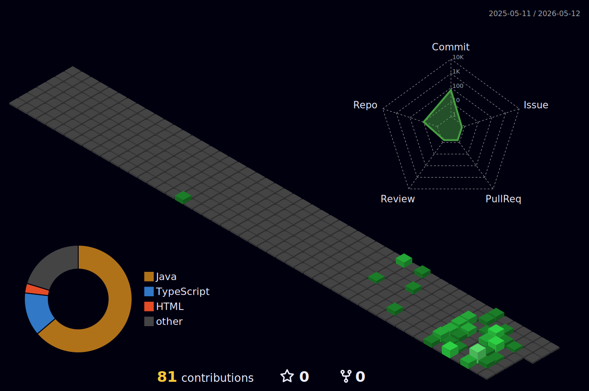
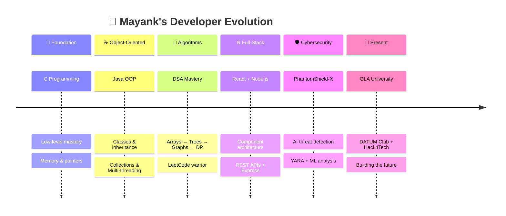

<!-- ═══════════════════════════════════════════════════════════════════ -->
<!-- ║  🔮 MAYANK RAJ — GITHUB PROFILE                                 ║ -->
<!-- ║  Theme: Purple + Violet + Cyan on Dark                          ║ -->
<!-- ═══════════════════════════════════════════════════════════════════ -->

<!-- ━━━━━━━━━━━━━━ TYPING INTRO ━━━━━━━━━━━━━━ -->
<p align="center">
  <a href="https://github.com/mayank7720">
    
  </a>
</p>

<!-- ━━━━━━━━━━━━━━ SOCIAL LINKS ━━━━━━━━━━━━━━ -->
<p align="center">
  <a href="https://www.linkedin.com/in/mayank-raj-221522381/">
    
  </a>&nbsp;&nbsp;
  <a href="https://github.com/mayank7720">
    
  </a>&nbsp;&nbsp;
  <a href="mailto:mayankraj7720@gmail.com">
    
  </a>&nbsp;&nbsp;
  <a href="https://mayank7720.github.io/My-Portfolio/">
    
  </a>
</p>


<!-- ━━━━━━━━━━━━━━ ABOUT + METRICS ━━━━━━━━━━━━━━ -->


**💻 Tech Stack:**<br><br>

<p>
<b>Languages:</b>&nbsp;&nbsp;&nbsp;
&nbsp;&nbsp;
&nbsp;&nbsp;
&nbsp;&nbsp;
&nbsp;&nbsp;
&nbsp;&nbsp;
&nbsp;&nbsp;
&nbsp;&nbsp;
<br><br><br>

<b>Libraries & Frameworks:</b>&nbsp;&nbsp;&nbsp;
&nbsp;&nbsp;
&nbsp;&nbsp;
&nbsp;&nbsp;
&nbsp;&nbsp;
&nbsp;&nbsp;
&nbsp;&nbsp;
<br><br><br>

<b>Tools & Platforms:</b>&nbsp;&nbsp;&nbsp;
&nbsp;&nbsp;
&nbsp;&nbsp;
&nbsp;&nbsp;
&nbsp;&nbsp;
&nbsp;&nbsp;
&nbsp;&nbsp;
&nbsp;&nbsp;
&nbsp;&nbsp;
<br><br><br>

<b>Databases:</b>&nbsp;&nbsp;&nbsp;
&nbsp;&nbsp;
&nbsp;&nbsp;
&nbsp;&nbsp;
&nbsp;&nbsp;
</p><br><br>

<!-- ━━━━━━━━━━━━━━ GITHUB STATS ━━━━━━━━━━━━━━ -->

<h2 style="color:#a855f7; display: flex; align-items: center;">
  <a href="https://github.com/mayank7720" style="display: inline-flex; align-items: center; text-decoration: none;">
    
  </a>
  <span style="color:#a855f7; font-size: 1.5em; vertical-align: middle;">GitHub Stats:</span>
</h2>

<p>
  <br>
  <br>
  <br>
  
  
</p>

<!-- ━━━━━━━━━━━━━━ CONTRIBUTION SNAKE ━━━━━━━━━━━━━━ -->

<p align="center"></p>

<picture>
  <source media="(prefers-color-scheme: dark)" srcset="https://raw.githubusercontent.com/mayank7720/mayank7720/output/github-contribution-grid-snake-dark.svg">
  <source media="(prefers-color-scheme: light)" srcset="https://raw.githubusercontent.com/mayank7720/mayank7720/output/github-contribution-grid-snake.svg">
  
</picture>

<br>

<!-- ━━━━━━━━━━━━━━ 3D CONTRIBUTION CHART ━━━━━━━━━━━━━━ -->




<!-- ━━━━━━━━━━━━━━ FEATURED PROJECTS ━━━━━━━━━━━━━━ -->

<details open>
<summary><h2>📌 Pinned Projects</h2></summary>

<p align="left">
  <a href="https://github.com/mayank7720/PhantomShield-X">
    
  </a>
  <a href="https://github.com/mayank7720/Online-Food-Delivery-App-Backend">
    
  </a>
  <a href="https://github.com/mayank7720/My-Portfolio">
    
  </a>
  <a href="https://github.com/mayank7720/DSA-">
    
  </a>
</p>

<p align="left">
  <a href="https://github.com/mayank7720?tab=repositories"></a>
</p>

</details>

<hr>

<!-- ━━━━━━━━━━━━━━ PROJECT DEEP-DIVES ━━━━━━━━━━━━━━ -->

<details open>
<summary><h2>🚀 Project Deep-Dives</h2></summary>

### 🛡️ PhantomShield-X — AI Cybersecurity Platform

> 🔬 **Enterprise-grade AI-driven cybersecurity defense** with real-time threat detection, behavioral ML analysis, and multi-device endpoint protection.

| Feature | Detail |
|---------|--------|
| 🧠 AI Engine | Isolation Forest ML anomaly detection |
| 🔍 Scanning | Multi-layer YARA + EMBER + VirusTotal |
| 🌐 Analysis | URL & phishing detection engine |
| 🖥️ Agent | Cross-platform device monitoring |
| 🧩 Extension | Chrome Manifest V3 |
| 📡 Dashboard | Centralized admin control |

```
Tech: FastAPI + React + TypeScript + scikit-learn + YARA
```

<p>
  <a href="https://phantom-shield-x.vercel.app"></a>
  <a href="https://github.com/mayank7720/PhantomShield-X"></a>
</p>

---

### 🍔 Food Delivery Backend — Enterprise Java

> ☕ **Full-featured food delivery backend** — Pure Java, OOP, exception handling, collections, multi-threading.

- 🏗️ Clean MVC + SOLID architecture
- 🔐 Custom exception handling framework
- 📦 Collections-based order management
- 🧵 Multi-threaded order processing

</details>

<hr>

<!-- ━━━━━━━━━━━━━━ DEV QUOTE ━━━━━━━━━━━━━━ -->

<h3 style="color:#a855f7;">✍️ Random Dev Quote</h3>


<!-- ━━━━━━━━━━━━━━ HACKATHON & ACHIEVEMENTS ━━━━━━━━━━━━━━ -->

<details open>
<summary><h2>🏆 Achievements & Community</h2></summary>

<div align="center">

| 🎯 Achievement | 📋 Details |
|:---:|:---|
| 🏅 **DATUM Club** | Active member — Tech events & workshops at GLA University |
| 🚀 **Hack4Tech** | Hackathon participant & innovator |
| 🛡️ **PhantomShield-X** | Built enterprise AI cybersecurity platform |
| 📊 **DSA Grinder** | 200+ problems solved across platforms |
| 🌐 **Open Source** | Active contributor & maintainer |

</div>

</details>

<hr>

<!-- ━━━━━━━━━━━━━━ EVOLUTION TIMELINE ━━━━━━━━━━━━━━ -->




<!-- ━━━━━━━━━━━━━━ ASCII ART FOOTER ━━━━━━━━━━━━━━ -->

<div align="center">

```diff
+@ @ @ @ @ @ @ @ @ @ @ @ @ @ @ @ @ @ @ @ @ @ @ @ @ @ @ @+
@@                                                      @@
@@          ███╗   ███╗ █████╗ ██╗   ██╗ █████╗         @@
@@          ████╗ ████║██╔══██╗╚██╗ ██╔╝██╔══██╗        @@
@@          ██╔████╔██║███████║ ╚████╔╝ ███████║        @@
@@          ██║╚██╔╝██║██╔══██║  ╚██╔╝  ██╔══██║        @@
@@          ██║ ╚═╝ ██║██║  ██║   ██║   ██║  ██║        @@
@@          ╚═╝     ╚═╝╚═╝  ╚═╝   ╚═╝   ╚═╝  ╚═╝        @@
@@                                                      @@
@@       ███╗   ██╗██╗  ██╗     ██████╗  █████╗          @@
@@       ████╗  ██║██║ ██╔╝     ██╔══██╗██╔══██╗         @@
@@       ██╔██╗ ██║█████╔╝      ██████╔╝███████║         @@
@@       ██║╚██╗██║██╔═██╗      ██╔══██╗██╔══██║         @@
@@       ██║ ╚████║██║  ██╗     ██║  ██║██║  ██║         @@
@@       ╚═╝  ╚═══╝╚═╝  ╚═╝     ╚═╝  ╚═╝╚═╝  ╚═╝         @@
@@                                                      @@
@@    "The code is the canvas, and we are the artists."  @@
@@                  — Mayank Raj 💜                      @@
@@                                                      @@
@@  A habit missed once is a mistake,                    @@
@@  A habit missed twice is a start of new habit!        @@
@@                                                      @@
@@    .-----------------------------------.              @@
@@    | while( ! (succeed = try()) );     |              @@
@@    '-----------------------------------'              @@
@@                                                      @@
+@ @ @ @ @ @ @ @ @ @ @ @ @ @ @ @ @ @ @ @ @ @ @ @ @ @ @ @+
```

</div>


<!-- ━━━━━━━━━━━━━━ VISITOR BADGE + FOOTER ━━━━━━━━━━━━━━ -->

<p align="center">
  
  &nbsp;&nbsp;
  <a href="https://github.com/mayank7720?tab=followers">
    
  </a>
  &nbsp;&nbsp;
  <a href="https://github.com/mayank7720?tab=repositories">
    
  </a>
</p>

<br>

<p align="center">
  
</p>

<p align="center">
  
</p>

<!-- ━━━━━━━━━━━━━━━━━━━━━━━━━━━━━━━━━━━━━━━━━━━ -->
<!-- 💜 Crafted with obsession by Mayank Raj       -->
<!-- 🔗 github.com/mayank7720                      -->
<!-- ━━━━━━━━━━━━━━━━━━━━━━━━━━━━━━━━━━━━━━━━━━━ -->
