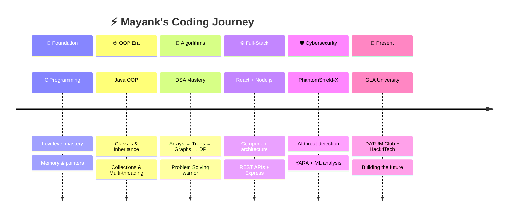

<!-- ╔═══════════════════════════════════════════════════════════════╗ -->
<!-- ║  ⚡ MAYANK RAJ — ELITE DEVELOPER PROFILE                     ║ -->
<!-- ║  Theme: Space-Tech × Iron Man HUD × Neon Cyber               ║ -->
<!-- ╚═══════════════════════════════════════════════════════════════╝ -->

<!-- ═══════════════ HERO LANDING ═══════════════ -->
<p align="center">
  
</p>

<p align="center">
  
</p>

<p align="center">
  <a href="https://github.com/mayank7720">
    
  </a>
</p>

<!-- CTA BUTTONS -->
<p align="center">
  <a href="https://github.com/mayank7720?tab=repositories">
    
  </a>&nbsp;&nbsp;
  <a href="https://www.linkedin.com/in/mayank-raj-221522381/">
    
  </a>&nbsp;&nbsp;
  <a href="mailto:mayankraj7720@gmail.com">
    
  </a>
</p>

<p align="center">
  
  &nbsp;
  <a href="https://github.com/mayank7720?tab=followers"></a>
  &nbsp;
  
  &nbsp;
  
</p>


<!-- ═══════════════ ABOUT ME ═══════════════ -->

<p align="center">
  
</p>

<h2 align="center">
  
  &nbsp;About Me&nbsp;
  
</h2>


```js
const mayank = {
  name: "Mayank Raj",
  title: "Future Software Engineer",
  location: "India 🇮🇳",
  education: "B.Tech CSE @ GLA University (1st Year)",
  club: "DATUM CLUB — Technical Team",
  languages: ["Java", "Python", "C", "JavaScript", "TypeScript"],
  frameworks: ["React", "Node.js", "Express.js", "Next.js"],
  databases: ["MySQL", "MongoDB", "Firebase"],
  currentFocus: ["DSA Mastery", "Full Stack Dev", "AI Products"],
  mindset: "Build. Learn. Win. Repeat. 🔁",
  funFact: "I speak fluent Java ☕ and sarcasm 😏"
};
```

> 🚀 **Passionate 1st-year coder** turning ideas into real products  
> 🧠 **Hackathon builder** who thrives under pressure  
> 🌱 **Fast learner** leveling up every single day  
> 💡 **Innovator** at DATUM Club, GLA University  
> ☕ Currently turning caffeine into production-ready code...

<br clear="both"/>


<!-- ═══════════════ TECH ARSENAL ═══════════════ -->

<h2 align="center">⚔️ Tech Arsenal</h2>

<p align="center">
  
</p>

<table align="center">
<tr>
  <td align="center" width="130"><h4>⚔️ Core</h4></td>
  <td align="center">
    
  </td>
</tr>
<tr>
  <td align="center" width="130"><h4>🚀 Frameworks</h4></td>
  <td align="center">
    
  </td>
</tr>
<tr>
  <td align="center" width="130"><h4>🗄️ Data</h4></td>
  <td align="center">
    
  </td>
</tr>
<tr>
  <td align="center" width="130"><h4>🛠️ DevOps</h4></td>
  <td align="center">
    
  </td>
</tr>
</table>

<p align="center">
  
  
  
  
  
  
</p>


<!-- ═══════════════ GITHUB POWER STATS ═══════════════ -->

<h2 align="center">📊 GitHub Power Stats</h2>

<p align="center">
  
</p>

<p align="center">
  
  &nbsp;&nbsp;
  
</p>

<p align="center">
  
</p>

<p align="center">
  
</p>

<p align="center">
  
  
  
</p>

<p align="center">
  
</p>

<!-- TROPHIES -->
<p align="center">
  
</p>

<!-- SNAKE -->
<p align="center">
  <picture>
    <source media="(prefers-color-scheme: dark)" srcset="https://raw.githubusercontent.com/mayank7720/mayank7720/output/github-contribution-grid-snake-dark.svg">
    <source media="(prefers-color-scheme: light)" srcset="https://raw.githubusercontent.com/mayank7720/mayank7720/output/github-contribution-grid-snake.svg">
    
  </picture>
</p>

<!-- 3D CONTRIBUTION -->
<p align="center">
  
</p>


<!-- ═══════════════ FEATURED PROJECT VAULT ═══════════════ -->

<h2 align="center">🏆 Featured Project Vault</h2>

<p align="center">
  
</p>

<div align="center">
  <a href="https://github.com/mayank7720/PhantomShield-X">
    
  </a>
  <a href="https://github.com/mayank7720/Online-Food-Delivery-App-Backend">
    
  </a>
  <a href="https://github.com/mayank7720/My-Portfolio">
    
  </a>
  <a href="https://github.com/mayank7720/DSA-">
    
  </a>
</div>

<br/>

<details>
<summary><h3>🛡️ PhantomShield-X — AI Cybersecurity Platform</h3></summary>
<br/>

> 🔬 **Enterprise-grade AI-driven cybersecurity defense** with real-time threat detection, behavioral ML analysis, and multi-device endpoint protection.

| Feature | Detail |
|---------|--------|
| 🧠 AI Engine | Isolation Forest ML anomaly detection |
| 🔍 Scanning | Multi-layer YARA + EMBER + VirusTotal |
| 🌐 Analysis | URL & phishing detection engine |
| 🖥️ Agent | Cross-platform device monitoring |
| 🧩 Extension | Chrome Manifest V3 |

```
Tech: FastAPI + React + TypeScript + scikit-learn + YARA
```

<p align="center">
  <a href="https://phantom-shield-x.vercel.app"></a>
  <a href="https://github.com/mayank7720/PhantomShield-X"></a>
</p>
</details>

<details>
<summary><h3>🍔 Food Delivery Backend — Enterprise Java</h3></summary>
<br/>

> ☕ **Full-featured food delivery backend** — Pure Java, OOP, exception handling, collections, multi-threading.

- 🏗️ Clean MVC + SOLID architecture
- 🔐 Custom exception handling framework
- 📦 Collections-based order management
- 🧵 Multi-threaded order processing
</details>

<p align="center">
  <a href="https://github.com/mayank7720?tab=repositories">
    
  </a>
</p>


<!-- ═══════════════ ACHIEVEMENTS ═══════════════ -->

<h2 align="center">🎖️ Achievements & Trophies</h2>

<div align="center">

| 🏆 | Achievement | Details |
|:---:|:---|:---|
| 🛡️ | **DATUM Club — Technical Team** | Active member at GLA University |
| 🚀 | **Hackathon Competitor** | Built projects under pressure |
| 🧠 | **Fast Learner** | 1st year → Full-stack + AI projects |
| ⚔️ | **Problem Solver** | DSA grinder across platforms |
| 🌐 | **Open Source Contributor** | Active maintainer & contributor |
| 🛡️ | **PhantomShield-X** | Enterprise AI cybersecurity platform |

</div>


<!-- ═══════════════ CURRENT MISSIONS ═══════════════ -->

<h2 align="center">🎯 Current Missions</h2>

```
╔══════════════════════════════════════════════════════════════╗
║                   MISSION CONTROL CENTER                     ║
╠══════════════════════════════════════════════════════════════╣
║                                                              ║
║  [■■■■■■░░░░]  60%  → Master DSA in Java                   ║
║  [■■■■■░░░░░]  50%  → Become Full Stack Engineer            ║
║  [■■■░░░░░░░]  30%  → Build AI-Powered Products             ║
║  [■■░░░░░░░░]  20%  → Grow Open Source Presence              ║
║  [■■■■■■■░░░]  70%  → Win More Hackathons                   ║
║                                                              ║
║  STATUS: ALL SYSTEMS GO 🟢                                   ║
╚══════════════════════════════════════════════════════════════╝
```


<!-- ═══════════════ EVOLUTION TIMELINE ═══════════════ -->

<h2 align="center">🧬 Developer Evolution</h2>




<!-- ═══════════════ DEV QUOTE ═══════════════ -->

<h2 align="center">💬 Dev Wisdom</h2>

<p align="center">
  
</p>


<!-- ═══════════════ CONNECT HUB ═══════════════ -->

<h2 align="center">🌐 Connect Hub</h2>

<p align="center">
  <a href="https://github.com/mayank7720">
    
  </a>&nbsp;&nbsp;
  <a href="https://www.linkedin.com/in/mayank-raj-221522381/">
    
  </a>&nbsp;&nbsp;
  <a href="mailto:mayankraj7720@gmail.com">
    
  </a>&nbsp;&nbsp;
  <a href="https://mayank7720.github.io/My-Portfolio/">
    
  </a>
</p>

<br/>

<p align="center">
  
</p>


<!-- ═══════════════ COSMIC FOOTER ═══════════════ -->

<div align="center">

```diff
+@ @ @ @ @ @ @ @ @ @ @ @ @ @ @ @ @ @ @ @ @ @ @ @ @ @ @ @ @ @ @ @ @ @ @+
@@       _____ _                 _                                    @@
@@      |_   _| |__   __ _ _ __ | | _____                            @@
@@        | | | '_ \ / _` | '_ \| |/ / __|                           @@
@@        | | | | | | (_| | | | |   <\__ \                            @@
@@        |_| |_| |_|\__,_|_| |_|_|\_\___/                           @@
@@                                                                    @@
@@     for entering my code universe. 🌌                              @@
@@                                                                    @@
@@     ╔═══════════════════════════════════════════════╗               @@
@@     ║  "The code is the canvas,                    ║               @@
@@     ║   and we are the artists."                   ║               @@
@@     ║                     — Mayank Raj 💎           ║               @@
@@     ╚═══════════════════════════════════════════════╝               @@
@@                                                                    @@
@@     .-------------------------------------------.                  @@
@@     |  while( !(succeed = try()) );             |                  @@
@@     '-------------------------------------------'                  @@
@@                                                                    @@
+@ @ @ @ @ @ @ @ @ @ @ @ @ @ @ @ @ @ @ @ @ @ @ @ @ @ @ @ @ @ @ @ @ @ @+
```

</div>

<p align="center">
  
</p>

<p align="center">
  
</p>

<!-- ═══════════════════════════════════════════ -->
<!-- 💎 Crafted with obsession by Mayank Raj     -->
<!-- 🔗 github.com/mayank7720                    -->
<!-- ═══════════════════════════════════════════ -->
